> 导语：这是一篇发表在arXiv预印本上对攻击多传感器自动驾驶模型的研究文献
>
> arXiv: 
>
> team:  Uber、多伦多大学、康奈尔大学

## 摘要

现在自动驾驶感知系统在图像和LiDAR辅助下进一步提升。单独使用2D图像容易遭受对抗样本的攻击。然而，现在研究融合LiDAR特征和图像特征的多模态模型的对抗鲁棒性的研究还很少。进一步地，现有的文献未考虑到物理实现跨输入模态扰动的一致性。本文作者通过在宿主车辆上放置对抗性物体来显示多传感器在实际中的脆弱性。作者聚焦在物理实现和不可知输入攻击，因为这些攻击可以应用到实际，并且展示了单一通用对抗可以将不同宿主车辆隐藏。实验表明，成功的攻击主要是由于图像特征的破坏造成的。进一步地，作者发现在现代传感器融合方法中，将图像特征映射成3D，对抗攻击可以利用3D投影过程在跨距离区域生成假阳性。对于更加鲁棒的多模态感知系统，作者发现利用特征去噪的对抗训练可以有效提高模型对于这类攻击的鲁棒性。然而，作者也发现标准对抗防御方法很难防止假阳性，因为这是由3D LiDAR点和2D像素的不准确关联造成的。

## 1 引言

自动驾驶感知的最新进展表明，融合来自多个传感器的信息（图像、光学雷达（LiDAR）、雷达）与单传感器输入相比具有巨大的性能优势。这些性能增益主要是来自包含在不同类型传感器衡量附属信息。例如，光学雷达传感器提供了准确的3D几何信息，而相机捕获丰富的外观信息。

在自动驾驶领域中，已经有很多工作研究单一传感器输入的攻击，如仅攻击图像，仅攻击光学雷达。而多模态鲁棒性方面，[61]考虑了光学雷达和图像作为输入扰动，导致扰动在跨模态时不一致，从而物理不可实现，进而不会对实际应用造成威胁。另一方面一些方法仅注重搜索形状而忽略了破坏图像的输入的纹理。此外，这些工作均为未考虑生成通用扰动，而通用扰动在实际中更真实。这种扰动是输入感知的，在训练分布上攻击任何输入可以达到很高的攻击成功率，意味着它们可以在不需要场景的先验知识情况下执行，并且跨时间一致地破坏处理传感器信息的模型。

本文证明了多传感器检测模型对物理可实现和输入不可感知对抗攻击的脆弱性。为了创造物理可实现的攻击，作者聚焦在插入攻击，因为它们可以在真实世界应用。与[60]类似，作者通过将对抗物体放置在宿主车辆的车顶将对抗物体插入场景中。作者将对抗物渲染到LiDAR和输入图像来确保扰动在跨模态之间的一致性，从而实现攻击的物理实现。在攻击中为了达到更高的真实度，在渲染过程中考虑LiDAR和图像遮挡的环境光照，如图2。进一步地，在训练分布上得到所有车辆上取得最优以创造一种应用到任何场景车辆的通用攻击。

## 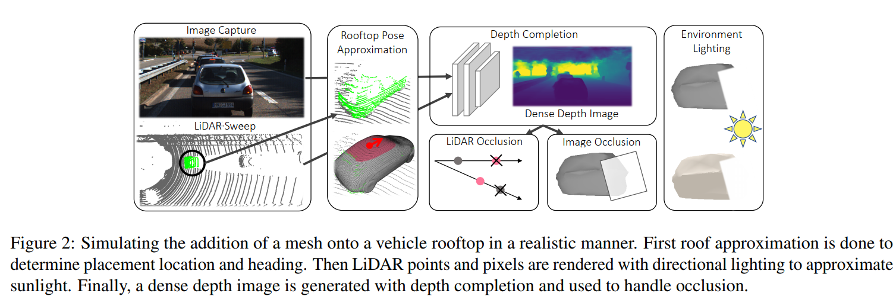

目标检测和语义分割的对抗样本有[67,42,14,40,36,63]。早期方法假设知道目标攻击的梯度信息知识，即白盒攻击。后来的研究发现黑盒攻击也能取得与白盒攻击相似的攻击效果[50,5,34]。对抗攻击的防御和鲁棒评估方法也得到了探索。

目标物体插入的攻击是更加现实的攻击，因为向图像中插入一个物体能改变网络的输出而语义不会发生改变。这些攻击可以看作是贴纸粘贴到目标物体上，然后展现在相机前面。另一方面，语义对抗攻击旨在使用生成模型来编辑图像的语义属性，同时保证原始的身份。图像渲染在这些非基于像素的攻击中同样是一个非常受欢迎的技术，如通过使变得可微分，通过改变光照和亮度实现对抗攻击。其他目标插入攻击设计了可以渲染在目标身上的伪装纹理。[74,64,17,29,15]。

自动驾驶汽车针对对抗攻击的安全性和鲁棒性也得到了广泛的研究。除了典型的基于图像的攻击外，自动驾驶汽车上还配备了光学雷达传感器，一些工作聚焦将点云作为输入模态。虽然他们在思想上与基于图像的攻击相似，这些攻击通常无法由光学雷达在3D空间中实现，因为这些扰动点不能保证被射线投影生成。而更真实地攻击，[8,57]在3D空间中添加恶意地光学雷达点来实现欺骗攻击，而[66,9,60]等方法则优化对抗3D网格表面，并使用可微地射线光束来生成光学雷达点云。

尽管多模态传感器被广泛地应用在自动驾驶汽车中，但是对多模态传感器攻击的研究仍然有限。一些初步的工作展示了攻击多传感器融合网络。然而他们并未考虑到当扰动图像时，数据数据模态之间的一致性。也未考虑到图像纹理缺乏攻击表示性。尽管实验表明结合攻击多模态有助于构建更强的攻击，最近的研究同样展示了不同的结论，即多任务学习可以生成更加鲁棒的网络[44]。作者提问，当要求同时输入认知和物理可实现时，多传感器融合能否更鲁棒？

## 3. 多传感器对抗学习

在本章节，作者提出了一种生成对抗纹理网格的通用方法，来攻击多传感器目标检测器。作者主要的攻击对象是光学雷达-图像目标检测器MMF，一种应用于现代自动驾驶系统的SOTA多传感器网络。作者认为提出的方法足以攻击多传感器融合模块（被很多网络种采用）。具体地，对抗性多传感器攻击满足以下几个条件：

+ 输入不可知，因此其能应用于不同环境。
+ 跨图像和光学雷达输入的几何一致性。
+ 可大规模全自动的实现。

为此，作者设计的框架包括：物理可实现光学雷达攻击，可微分渲染技术，多模态传感器融合网络。作者的攻击聚焦于车辆而不是更受欢迎的道路。

**Preliminaries**:  作者考虑了鸟瞰图目标检测模型F，其接收相机图像$x_I \in [0, 1]^{H \times W \times 3}$​​和光学雷达点云$x_L \in R^{P \times 3}$​​作为输入。其中P表示光学点云的数量，每帧中的数量都不一样。目标检测器以鸟瞰图视角的边界框标注Y，每个边界框实例$b \in Y$​由$b=(b_x, b_y, b_h, b_w, b_\alpha)$​​​参数化。结果，bx, by是边界框中心的坐标，bh, bw是边界框的宽和高。bα表示角度。

为了同时处理图片和光学雷达， 目标检测器使用两个分支从各种模态种提取特征，也就是图像编码器$f_I$和光学雷达编码器$f_L$。为了融合2D图像特征和3D光学雷达特征。图像特征由连续的融合层$\otimes$作为3D传感器融合器投影到鸟瞰图voxel。此处的每个鸟瞰图voxel样本都接近于光学雷达点，获取每个像素对应的每个点，并且将指定这些图像像素投影到鸟瞰图(BEV)voxel。最终，融合分支$f_M$通过相加的方式聚集了投影图像特征图和光学雷达特征图。具体地，整个模型推断表示如下：

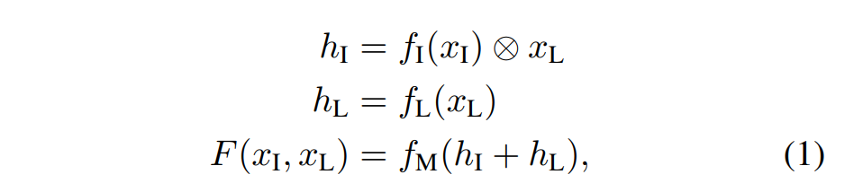

其中$h_I$和$h_L$​分别表示投影的图像特征和光学雷达特征。这种设计选择已被证明可以改进补充输入数据模式，正如相机提供的富语义信息，但不易于提取准确的3D几何。然而，光学雷达可以捕获准确得几何特征但是不能捕获丰富得语义信息。

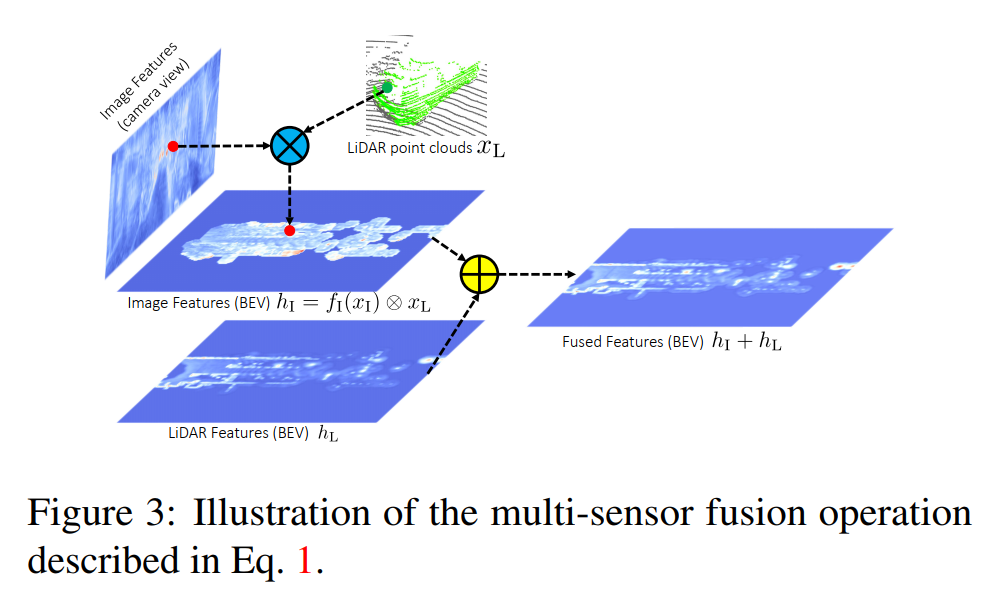

### 3.1 多传感器模拟实现目标插入

在本文，作者设计了一种框架将纹理网格插入场景中，外观和形状均可扰动实现攻击多个传感器系统。具体地，将一个三角形网格$M=(V,F, \Tau)$​​​贴在宿主车顶上，这种方法在物理上是真实世界可以实现的。网格由顶点坐标$V \in R^{N \times 3}$, faces的顶点索引$F\in N^{M \times 3}$，和每个faces的顶点纹理$\Tau \in R ^{M \times C \times C \times 3}$​​。其中N,M,C表示顶点的数量，三角形face的数量和每个face纹理的分辨率。​出于可扩展的源于，并未考虑透明度、反射材料、和阴影，因为处理每种情况都需要复杂的基于物理的渲染。相反，作者使用光学雷达射线和可微分图像渲染器来近似传感器模拟器。上述二者都是可微分的，在优化过程中，允许梯度从光学雷达点和图像像素回传至网格参数。整体的框架图如图2所示。

**顶部近似**：首先估计了车顶的中心来决定攻击者放置的3D位置。由[19,60,48]可知，搜先使用符号距离函数(signed distance functions, SDFs)表示车辆物体，并且使用PCA进一步将其投影到低维形状流。然后优化每辆的低纬度潜在code以最小化车辆点云和形状流行的fitting误差。然后使用防水车网与匹配立方体[41]将一个固定的SDF转换到防水车网。作者选择了车辆顶部的20cm作为近视车顶，使用车顶中心和车辆航向来确定对象插入的确切姿势。

**光学雷达模拟器**：为了模拟在光学雷达扫描中插入，作者根据用于收集原始扫描的特定光学雷达传感器来采样射线，如光束数和水平旋转速度。然后使用Moller-Trumbore算法[45,60]计算了这些射线和网格faces的入射角以获得对抗网格的仿真点云。然后这些仿真点被添加到原始的光学雷达扫描上。

**图像模拟器**：为了将对抗性嵌入图像中 ，作者从捕获原始图像的相机传感器中提取了内在参数和外在参数。然后使用轻量可微分渲染器SoftRas[39]来仿真网格像素。 在优化过程中使用软光栅器允许来自被遮挡和远距离顶点的梯度流，从而能够从像素梯度进行更好的 3D 推理。为了增强渲染图像的保真度，在有限距离内将方向光模型作为太阳光。

**遮挡推理**：由于将物体插入场景中，渲染过程必须考虑原始和新渲染光学雷达点和图像像素的遮挡问题。为了解决光学雷达遮挡，作者使用了光学雷达中已经扫描到的点，并比较了原始点和渲染点的深度。对于原始光学雷达扫描中生成点的每条射线和在对抗网格，作者考虑了最近点，并丢弃了被遮挡的其他点。为了处理图像遮挡问题，需要每个像素点的深度估计值。因此，首先将光学雷达点投影到图像上，来生成稀疏深度图像（因为图像的分辨率很高）。然后使用深度完整模型，该模型的输入是稀疏深度和RGB图像，输出密集像素点深度估计。使用密集深度图，作者丢弃了深度大于原始图像相关的像素的渲染的像素点。注意，作者并未攻击深度完整，因为它只是一个用于增加多传感器模拟器保真度的预处理过程。

### 3.2 通用对抗样本生成

使用可微渲染器方法模拟图像和光学雷达输入魔塔 的一致性扰动，现将描述过程生成多感知器对抗样本欺骗目标检测器模型F。将扰动后的检测输出描述为

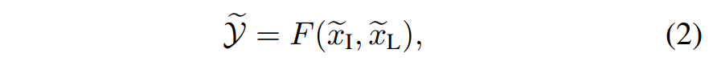

其中$(\widetilde{x_I},\widetilde{x_L})$是被扰动后的图像和光学雷达点云，$\widetilde{Y}$是相应的检测结果。

**对抗目标**：作者考虑两种不同焦点的对抗目标：假阴性和假阳性。为了生成假阴性攻击，与抑制所有宿主车辆的提取边界框攻击目标检测器[67,60]一样。将置信度大于0.1，并且与gt边界框重叠的视为相关提取框。对抗损失设计为最小化所有候选框的置信度。

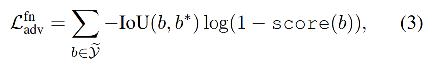

其中IOU表示联合算子上的交集，b*是要攻击的与gt框。

同样地，生成的错误边界框不能与场景中任何gt框重叠，称为假阳性生成。假阳性对抗损失增加了假阳性候选框的置信度

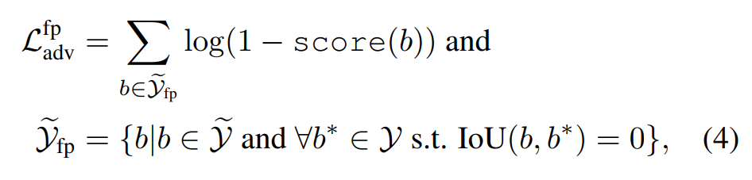

其中$\widetilde{Y_{fp}}$​表示不与任何gt目标边界框重叠的边界框提取框的子集。

**网格正则化**：除了对抗目标以外，作者使用额外的正则项来鼓励网格几何更加真实。具体地，使用拉普拉斯正则化项[39]，鼓励物理表面几何更加平滑：$L_{lap} = \sum_i||\delta_i||_2^2$，其中δi表示顶点vi到当前它的邻近质心的距离

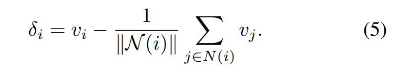

**学习输入不可知攻击**：总而言之，最后的优化目标可以总结成

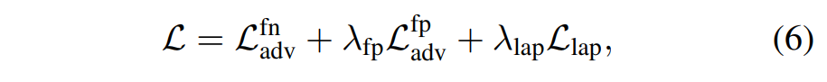

其中$\lambda_{fp}$​和$\lambda_{lap}$​​是假阳性损失项和网格正则化项的假阳性的重要性权重因子。使用这个目标函数在整个数据集上优化插入物体的形状和外观来生成输入不可知的对抗样本。

因此，作者的目的是最大化训练分布中所有车辆的期望损失L。具体地，将优化对抗的过程表示成如下的形式：

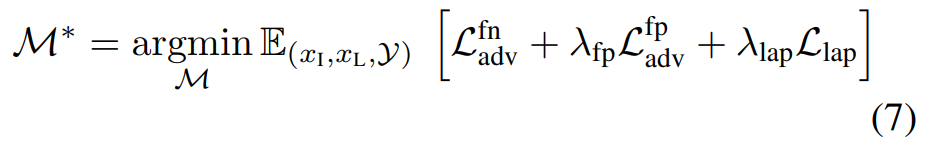

注意，在学习过程中F的网格拓扑没有发生变化。通过轴对齐3D框约束攻击者的物理尺寸。也就是，对于每个$j\in \left\{x, y, z\right\}$都需要$||V_j||_\infin \leq L_j$​，其中Lx, Ly, Lz表示约束框xyz轴。、

在训练集中针对所有车辆学习单一对抗网格来优化期望损失。使用作者提出的端到端优化的方法，在网格顶点的盒型约束下使用PGD来优化对抗网格。在实验中同样试验了单模态攻击。为实现单模态攻击，关闭了到非目标输入分支的梯度流，仍然将网格输入两个模态来保持图像和光学雷达模态的物理一致性。

### 3.3 多传感器对抗鲁棒

在进行成功的插入攻击时，作者也研究了防御这种攻击的机制。与单一传感器设置相比，多传感器对抗鲁棒性更加具有挑战性。首先，即使其他输入传感器上的扰动是非对抗性的，每个单一的输入模态也可能受到攻击。其次。从每个单一输入模态的对抗扰动会相互影响，这些在多传感器设置中是唯一的。因此，不仅需要处理每个输入模态的扰动，也需要处理每个融合层的影响。

我们采用对抗性训练，因为它是最标准和最可靠的防御方法。对抗训练可以表示成如下的模型参数公式

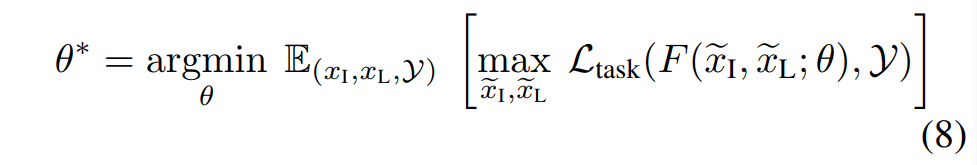

在扰动下最小化经验风险。这里Ltask是用于训练检测模型的损失函数。这个函数通过训练检测模型F对抗由威胁模型$\widetilde{x}$​生成的扰动。然而对抗训练典型地在应用在图像扰动上，可以在PGD生成的扰动图像上训练，作者的对抗样本生成是昂贵的最小最大化目标函数的内层循环生成的。因此，与在每个迭代过程中生成更强的对抗攻击不同，作者采用了自由的对抗训练和持续更新相同对抗者来减少计算量。

## 4 试验

本部分首先描述了数据集，攻击逻辑，验证指标。然后，展示了对每个数据集的白盒攻击和跨数据集的黑盒传输攻击的实证发现。最终，探索了包括对抗训练的几种防御方法实现一个更加鲁棒的面对多传感器检测。

### 4.1 实验设置

 两个自动驾驶数据集：

+ KITTI：370 * 1224分辨率。12284张车辆样本
+ XENITH：320 * 2048分辨率。77818张样本

我们将帧中的每辆车视为一个单独的样本，并特别要求插入主车辆车顶的对抗性网格从图像中至少可见 70%。数据集被进一步以7：3的比例进行分割。

**多传感器目标检测**：在KITTI数据集中，采取了多传感器目标检测网络MMF[37]来以鸟瞰图形式检测。在XENITH，使用了稍微不同的结构，这种结构被微调来获得性能的提升。多传感器检测有两个不同分支来提取从图像和光学雷达的特征，其中 LiDAR 点被体素化并处理为具有 2D 卷积的 BEV 图像，而图像则使用 ResNet 主干进行处理。对于传感器融合，在BEV中的每个voxel都进行了KNN来搜索最接近LiDAR点的样本。与前文工作一样，融合网络中使用了K=1的设置。

**指标**：遵循车顶对象插入攻击的先前工作[60]，作者的目的是生成假阴性并使得宿主车辆从目标检测器下“消失”。因此，**验证了宿主车辆在不同IoU阈值下的recall率**。此外，**还验证了假阴性攻击成功率（FN ASR），被定义成添加扰动前后宿主车辆被检测到的比例（未被检测/总样本）**。如果输出边界框的车辆的IOU值大于0.7时，认为宿主车辆被检测到。此外，为了在宿主车辆上产生漏检，攻击也可能产生误报。**如果输出边界框与任何地面实况框的最大重叠小于 0.3 IoU，我们将其视为误报。**进一步地，作者并没有统计与干净检测或宿主车辆重叠的边界框的数量。作者评估了假阳性攻击成功率(FP ASR)和产生至少一个误报的攻击百分比。最后，作者将总体攻击成功率 (ASR) 评估为成功创建误报或漏报的攻击的百分比。

**实现细节**：对抗网格被初始化成N=162顶点和M=320的生态圈。每个面的纹理使用纹理图集进行参数化，每个面的纹理分辨率为 5 × 5。为生成对抗网格，作者应用了参数为$\lambda_{lap}=0.001$​​和$\lambda_{fp}=1$​​​​的拉普拉斯因子。作者通过轴对齐的 3D 框进一步约束网格的比例，其中 x 和 y 坐标以 Lx = Ly = 0:8m 为界，z 坐标以 Lz = 0:5m 为界。使用学习率为0.0004的adam优化器来优化网格参数，0.001的参数来优化顶点坐标。为了孤立地定位光学雷达和图像分支，在反向传播至攻击者中时关闭了到其他分支的梯度流。

### 4.2 通用对抗攻击

**隐藏宿主攻击**：在检测宿主车辆时，作者评估了召回率的下降程度，因为漏检会影响自动驾驶对最危险结构的规划。扫描IOU的阈值并且可视化IOU-recall曲线，如图5所示。

首先展示了插入随机形状和外观的非对抗物体对性能的影响有限。其次输入模态的对抗网格扰动会导致recall率性能的极大下降。此外，我们单独扰乱了 LiDAR 和图像输入，并发现仅针对 LiDAR 输入会产生非常弱的攻击。此时，单独攻击图像强于同时扰动两个模态。作者相信图像输入的鲁棒性不如目标插入攻击。

**攻击成功率**：表1和表2，在攻击成功率的角度进一步分析了结果。作者将具有随机生成的几何和纹理的网格作为对比的baseline。

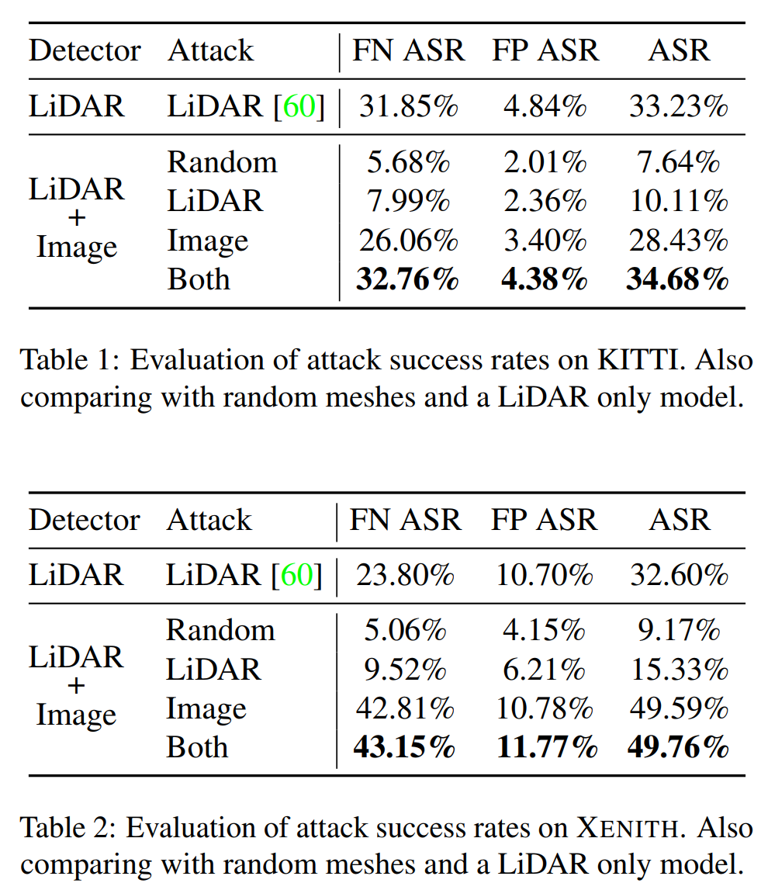

观察到图像特征明显更容易受到攻击的类似趋势。此外，除漏检之外，对抗性网络还能够通过生成现实世界中不存在的提取框来攻击检测器。进一步与之前的工作[60]相比，该工作仅攻击基于光学雷达的目标检测器。在这种情况下，合并输入图像可以提高对光学雷达攻击的鲁棒性，但是更容易受到图像扰动的影响。

**量化样本**：如图6展示量化样本。首先展示了将对抗网格放置到车顶上时检测器未能检测到宿主车辆的样本。为了便于展示，展示了图像而不是光学雷达。相同的对抗性网格用于数据集中的所有演示，因为我们的攻击与训练分布无关。进一步地，如图7所示，在不同距离位置生成网格的假阳性。检测在 BEV 中可视化，因为远处的物体在图像中显得太小。此外，在图像平面可视化图像特征和可视化将图像特征投影到3D空间，表明远程误报是由融合过程中相机的透视投影引起的。

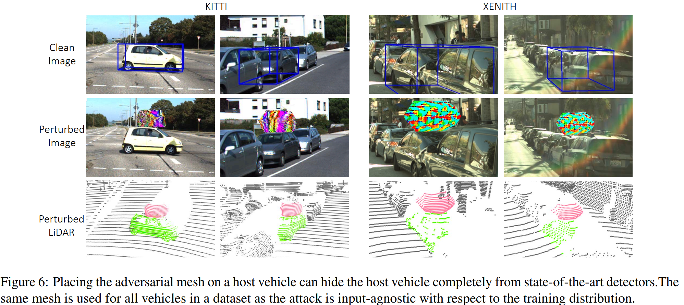

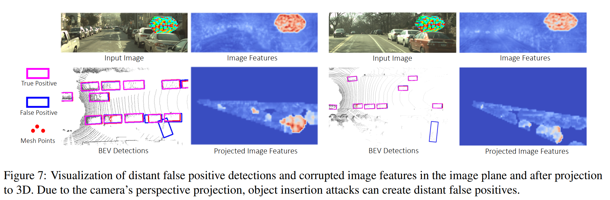

**黑盒迁移攻击**：作者还进行了跨数据集之间的黑盒迁移攻击，结果如表3所示。总体而言，我们对目标数据集的转移攻击比仅攻击源数据集上的 LiDAR 输入模态更强，尤其是从 XENITH 到 KITTI。另一方面，迁移性相对较低可能是因为图像分辨率和硬件，这超出了本文研究的范畴，并被作为未来探索的方向。

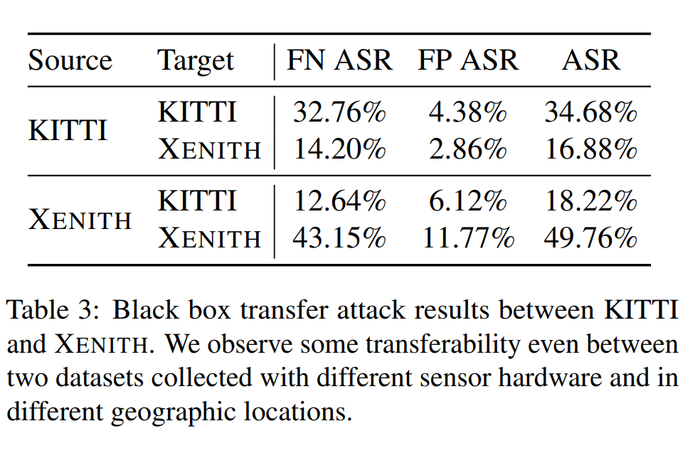

### 4.3 提升鲁棒性

**攻击防御方法**：正如经验发现表面图像特征更加脆弱，作者首先应用了现有的基于图像的防御方法通过JPEG压缩移除高频的组件。此外，应用对抗防御来抵抗攻击者。由于仿真过程，生成更强的攻击非常昂贵。因此采用了与FAT[54]类似的对抗训练策略并且通过连续更新相同的攻击目标来复用了过去的扰动。具体来说，我们对模型的每一次更新都会对对手进行 5 次更新。在对抗训练中组合了特征去噪来进一步增强对图像扰动地鲁棒性。报告了在0.7IOU时地成功率和平均准确虑来研究在干净数据上对抗鲁棒性。

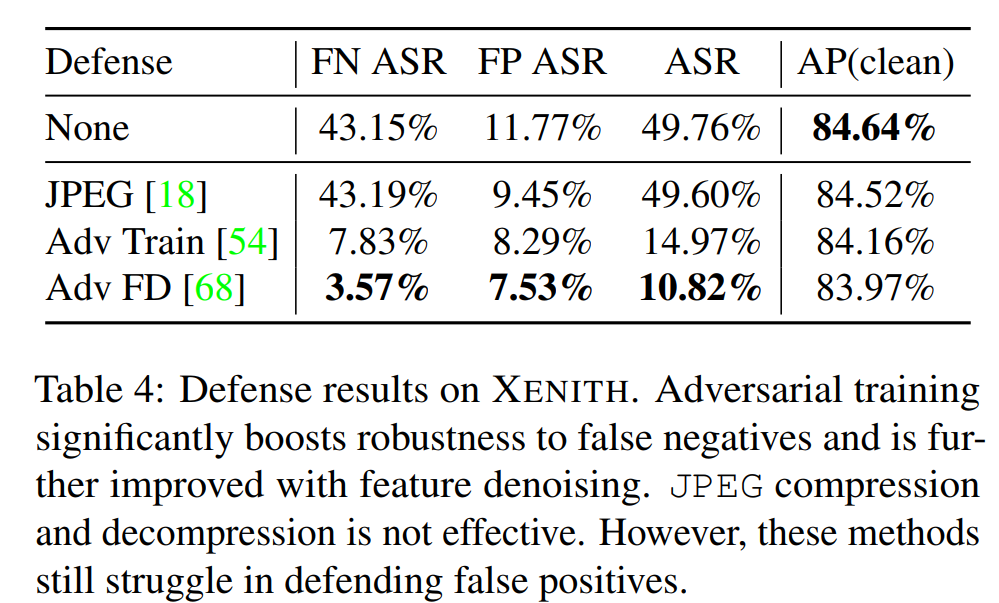

正如表4所示，作者发现JPEG作为防御方法地无效。作者认为这是由输入不可知攻击是由在训练中的不同姿势渲染而成，因此不会依赖由JPEG移除的高频信号。与此相比，对抗训练有效地降低了攻击成功率（49.76%到14.97%），AP降低了0.5%。最终，在图像语出模块中的每个残差块后添加非局部均值块来进一步增加鲁棒性，ASR降低了50%。

**讨论和未来工作**：尽管当前防御方法在恢复漏检上非常有效，但是他们很难检测到误报。作者认为这是因为在图7展示的远距离假阳性部分地对对抗扰动脆弱。实际上，这些样本利用了3D场景中目标地错误关联。具体地，网格像素和远离网格的 LiDAR 点之间的映射可以实现此类攻击。如果每个 LiDAR 点的指定像素移动几个像素，这些错误关联很容易发生，因为在 3D 中相距很远的对象在 2D 中可能看起来非常接近。作者确定了这在实践中如何发生地两个原因：

+ 由于DNN激活函数的感知域，对抗物体可以影响其物理边界框外的像素。
+ 光学雷达扫面收集的点是以一种旋转传感器的连续方式，周期间隔地瞬时采集图像。

因此，对于在图像之前和之后捕获的 LIDAR 点，用于投影的相机外在参数变得过时。因此，为了取得更加鲁棒的传感器的图像和光学雷达的融合，融合模型必须关于3D几何、上下文信息和光学雷达点的时间信息推理，以更加智能地生成像素和光学雷达点之间地映射。作者希望这些发现有助于激励未来在构建更加鲁棒融合方法的工作。

## 5 结论

作者提出了一种新颖的方法将对抗物体放置在宿主车辆车顶来攻击自动驾驶汽车中的多传感器融合目标检测器。提出的方法可以隐藏宿主车辆并同时生成误检率。与现有的方法相比，作者的攻击在更加现实的设置下工作，因为作者通过生成输入不可知和物理可实现的扰动来攻击图像和光学雷达输入模态。实验揭露了基于融合方法的多传感器目标检测的脆弱性，主要是由于不鲁棒的图像特征。使用图像特征进行的对抗去噪可以有效地恢复误检率，但是在特征融合时缺乏更深的3D几何推理，仍然难以检测假阳性。我们相信这项工作将为多传感器对抗学习领域开辟新的研究机会和挑战。

## 思考

优点：

+ 攻击了基于多传感器模态融合的自动驾驶系统；
+ 实验指标很完整（可以参考）
+ 论文讲得很清楚

缺点：

+ 虽然对抗补丁容易实现，但是在具体的物理世界中仍然是难以使用的，因为正常汽车不会再车顶放置东西。

